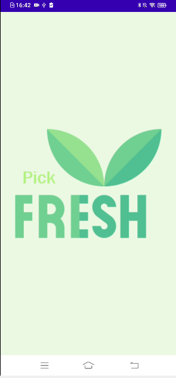
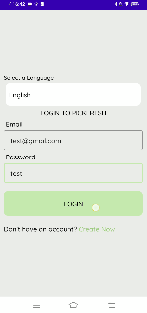
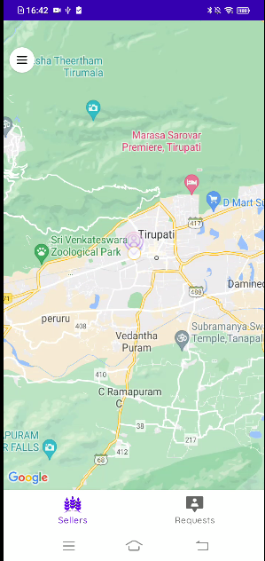

# 🍃 PickFresh – Connect Local Farmers and Buyers

PickFresh is an Android application built to empower local farmers by connecting them directly with nearby buyers. It enables seamless communication, reduces middlemen, and promotes fresh, farm-to-table products delivery.

---

## ✨ Features

- 👨‍🌾 Direct communication between farmers and buyers
- 🛒 Browse and request local products(vegetables, fruits, etc_
- 📍 Location-based matchmaking
- 🔔 Notifications for updates and offers
- 📱 Simple and clean user interface

---

## 🛠️ Tech Stack

- **Frontend:** Java | Android Studio
- **Backend:** Firebase (Realtime Database & Authentication)
- **Design:** XML Layouts, Material Components

---

## 📷 Screenshots

### 🏠 Home Screen

### 👨‍🌾 Farmer Dashboard

### 🗺️ Location & Maps Integration

